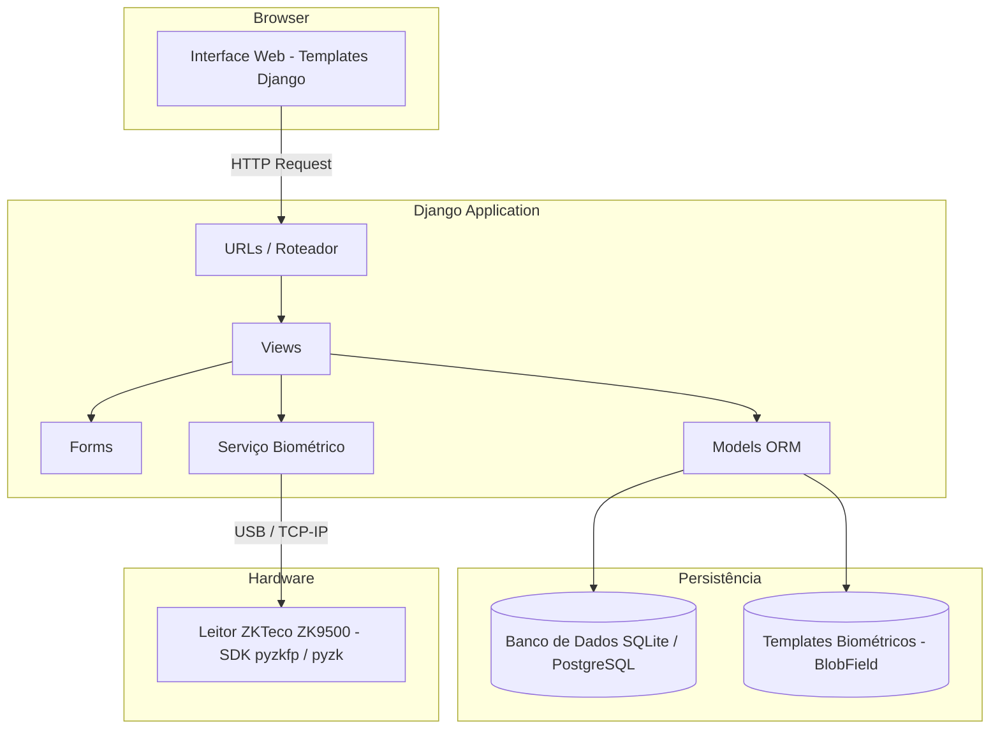
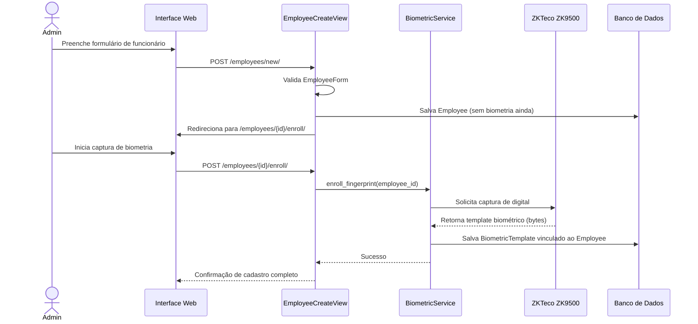
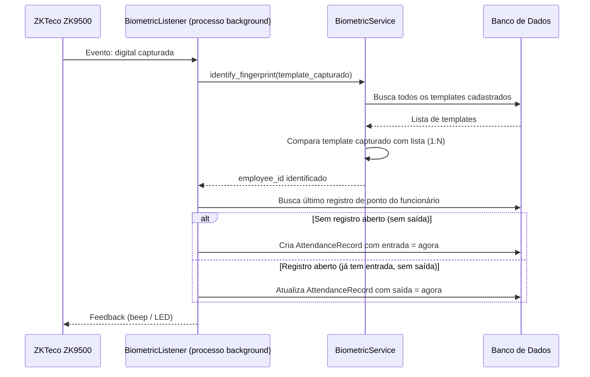

# Documento de Design: Employee & Truck Control

## Visão Geral

Sistema web desenvolvido em Python/Django para controle de ponto de funcionários via biometria digital (leitor ZKTeco ZK9500) e gestão de frota de caminhões da empresa. O sistema registra entradas e saídas automáticas dos funcionários por impressão digital, mantém o cadastro de veículos e gerencia a associação entre motoristas e caminhões.

Os funcionários são entidades gerenciadas (não usuários do sistema — não possuem login ou senha). O controle de acesso ao sistema administrativo web pode ser feito pelos usuários padrão do Django Admin.

---

## Arquitetura

O sistema segue a arquitetura MVT (Model-View-Template) padrão do Django, com um módulo auxiliar para comunicação com o leitor biométrico via SDK do ZKTeco.



---

## Diagramas de Sequência

### Cadastro de Funcionário com Biometria



### Registro de Ponto por Biometria



---

## Componentes e Interfaces

### Componente 1: Módulo `employees`

**Propósito**: Gerenciar o cadastro de funcionários e seus templates biométricos.

**Interface**:
```python
class EmployeeManager:
    def create_employee(data: dict) -> Employee
    def list_employees() -> QuerySet[Employee]
    def get_employee(employee_id: int) -> Employee
    def enroll_fingerprint(employee_id: int, template: bytes) -> BiometricTemplate
    def get_template(employee_id: int) -> BiometricTemplate | None
```

**Responsabilidades**:
- CRUD de funcionários
- Armazenamento de templates biométricos como BinaryField no banco de dados
- Validação dos dados do formulário de cadastro

---

### Componente 2: Módulo `trucks`

**Propósito**: Gerenciar o cadastro de caminhões e a associação com motoristas.

**Interface**:
```python
class TruckManager:
    def create_truck(data: dict) -> Truck
    def list_trucks() -> QuerySet[Truck]
    def get_truck(truck_id: int) -> Truck
    def assign_driver(truck_id: int, employee_id: int) -> TruckAssignment
    def list_assignments(truck_id: int) -> QuerySet[TruckAssignment]
    def get_current_driver(truck_id: int) -> Employee | None
```

**Responsabilidades**:
- CRUD de caminhões (placa, modelo, cor, chassi)
- Registro de associações motorista↔caminhão com data
- Listagem do histórico de associações

---

### Componente 3: Módulo `attendance`

**Propósito**: Registrar e consultar os pontos de entrada/saída dos funcionários.

**Interface**:
```python
class AttendanceService:
    def record_entry(employee_id: int) -> AttendanceRecord
    def record_exit(employee_id: int) -> AttendanceRecord
    def get_open_record(employee_id: int) -> AttendanceRecord | None
    def list_records(employee_id: int) -> QuerySet[AttendanceRecord]
    def process_biometric_event(template: bytes) -> AttendanceRecord
```

**Responsabilidades**:
- Criação de registros de ponto
- Determinação automática de entrada/saída (toggle)
- Consulta de histórico de ponto

---

### Componente 4: `BiometricService`

**Propósito**: Abstração para comunicação com o leitor ZKTeco ZK9500 via biblioteca Python (`pyzkfp` ou `pyzk`).

**Interface**:
```python
class BiometricService:
    def connect() -> bool
    def disconnect() -> None
    def capture_template() -> bytes
    def identify(template: bytes, templates: list[tuple[int, bytes]]) -> int | None
    def start_listener(callback: Callable[[bytes], None]) -> None
    def stop_listener() -> None
```

**Responsabilidades**:
- Conexão/desconexão com o leitor via USB ou TCP/IP
- Captura de template durante o cadastro
- Identificação 1:N (comparar digital capturada com todos os templates)
- Listener contínuo em processo background para eventos de ponto

---

## Modelos de Dados

### Model: `Employee`

```python
class Employee(models.Model):
    name        = models.CharField(max_length=200)
    role        = models.CharField(max_length=100)          # cargo
    department  = models.CharField(max_length=100, blank=True)
    phone       = models.CharField(max_length=20, blank=True)
    hire_date   = models.DateField()
    is_driver   = models.BooleanField(default=False)        # indica se pode ser motorista
    is_active   = models.BooleanField(default=True)
    created_at  = models.DateTimeField(auto_now_add=True)
    updated_at  = models.DateTimeField(auto_now=True)
```

**Regras de validação**:
- `name` é obrigatório e não pode ser vazio
- `hire_date` não pode ser data futura
- `is_driver=True` é necessário para associar ao caminhão

---

### Model: `BiometricTemplate`

```python
class BiometricTemplate(models.Model):
    employee    = models.OneToOneField(Employee, on_delete=models.CASCADE, related_name='biometric')
    template    = models.BinaryField()                      # raw bytes do ZKTeco
    finger_index = models.SmallIntegerField(default=0)      # índice do dedo (0-9)
    enrolled_at = models.DateTimeField(auto_now_add=True)
    updated_at  = models.DateTimeField(auto_now=True)
```

**Regras de validação**:
- Um funcionário pode ter no máximo um template ativo (OneToOne)
- `template` não pode ser vazio (bytes de tamanho > 0)

---

### Model: `Truck`

```python
class Truck(models.Model):
    license_plate = models.CharField(max_length=10, unique=True)   # placa
    model         = models.CharField(max_length=100)               # modelo
    color         = models.CharField(max_length=50)                # cor
    chassis       = models.CharField(max_length=50, unique=True)   # chassi
    year          = models.IntegerField(null=True, blank=True)
    is_active     = models.BooleanField(default=True)
    created_at    = models.DateTimeField(auto_now_add=True)
    updated_at    = models.DateTimeField(auto_now=True)
```

**Regras de validação**:
- `license_plate` deve ser único e seguir formato válido (ex: padrão Mercosul `AAA0A00`)
- `chassis` deve ser único (VIN de 17 caracteres alfanuméricos)
- `model` e `color` são obrigatórios

---

### Model: `TruckAssignment`

```python
class TruckAssignment(models.Model):
    truck       = models.ForeignKey(Truck, on_delete=models.PROTECT, related_name='assignments')
    driver      = models.ForeignKey(Employee, on_delete=models.PROTECT, related_name='truck_assignments')
    assigned_at = models.DateTimeField(default=timezone.now)
    unassigned_at = models.DateTimeField(null=True, blank=True)    # null = associação ativa
    notes       = models.TextField(blank=True)

    class Meta:
        ordering = ['-assigned_at']
```

**Regras de validação**:
- `driver.is_driver` deve ser `True`
- Um caminhão só pode ter um motorista ativo por vez (`unassigned_at=None` único por `truck`)
- `assigned_at` não pode ser posterior a `unassigned_at`

---

### Model: `AttendanceRecord`

```python
class AttendanceRecord(models.Model):
    employee    = models.ForeignKey(Employee, on_delete=models.PROTECT, related_name='attendance_records')
    entry_time  = models.DateTimeField()
    exit_time   = models.DateTimeField(null=True, blank=True)    # null = ponto em aberto
    date        = models.DateField()                             # data do registro (para consultas)
    created_at  = models.DateTimeField(auto_now_add=True)

    class Meta:
        ordering = ['-entry_time']
        indexes = [
            models.Index(fields=['employee', 'date']),
            models.Index(fields=['employee', 'exit_time']),
        ]
```

**Regras de validação**:
- `exit_time` deve ser posterior a `entry_time`
- Cada funcionário pode ter no máximo um registro em aberto (`exit_time=None`) por vez

---

## Tratamento de Erros

### Cenário 1: Leitor biométrico não encontrado

**Condição**: Dispositivo ZKTeco ZK9500 não conectado ou não reconhecido pelo sistema.
**Resposta**: `BiometricService.connect()` lança `BiometricDeviceNotFoundError`. A view exibe mensagem de erro amigável ao usuário e registra no log.
**Recuperação**: Usuário reconecta o dispositivo e tenta novamente.

---

### Cenário 2: Digital não reconhecida

**Condição**: Template capturado não corresponde a nenhum funcionário cadastrado (identificação 1:N falha).
**Resposta**: `BiometricService.identify()` retorna `None`. O listener registra o evento como "digital desconhecida" no log e emite feedback sonoro/visual diferenciado no leitor.
**Recuperação**: Funcionário tenta novamente; se persistir, requer recadastro da biometria.

---

### Cenário 3: Placa ou chassi duplicado

**Condição**: Tentativa de cadastrar caminhão com `license_plate` ou `chassis` já existente.
**Resposta**: Django ORM lança `IntegrityError`. O formulário exibe mensagem de validação específica por campo.
**Recuperação**: Usuário corrige o dado duplicado.

---

### Cenário 4: Associação duplicada de motorista

**Condição**: Tentativa de associar um caminhão que já possui motorista ativo.
**Resposta**: A view verifica a existência de `TruckAssignment` ativo antes de salvar e retorna erro de validação de formulário.
**Recuperação**: Usuário encerra a associação anterior antes de criar a nova.

---

## Estratégia de Testes

### Testes Unitários

- Validações dos models (`Employee`, `Truck`, `TruckAssignment`, `AttendanceRecord`)
- Lógica de toggle entrada/saída do `AttendanceService.process_biometric_event()`
- Regra de motorista único ativo por caminhão
- Validação de formato de placa e chassi

### Testes Baseados em Propriedades

**Biblioteca**: `hypothesis` com `pytest`

**Propriedades a testar**:
- Para qualquer sequência de eventos biométricos de um funcionário, a quantidade de entradas deve ser igual à quantidade de saídas (±1 se ponto em aberto)
- Para qualquer caminhão, nunca deve haver dois `TruckAssignment` ativos simultaneamente
- O campo `exit_time` nunca deve ser anterior ao `entry_time` para nenhum `AttendanceRecord`

### Testes de Integração

- Fluxo completo de cadastro de funcionário + enroll biométrico (com mock do ZKTeco SDK)
- Fluxo completo de associação caminhão↔motorista
- Simulação de eventos de ponto via mock do `BiometricService`

---

## Considerações de Desempenho

- A busca de templates biométricos para identificação 1:N carrega todos os templates do banco; para volumes > 500 funcionários, considerar cache em memória com invalidação por sinal Django (`post_save`).
- Índice no campo `exit_time` de `AttendanceRecord` para consultas de "ponto em aberto" eficientes.
- O `BiometricListener` deve rodar em thread ou processo separado (ex: `threading.Thread` ou Django Management Command como daemon) para não bloquear o servidor web.

---

## Considerações de Segurança

- Templates biométricos são dados sensíveis (LGPD); armazenados como `BinaryField` no banco, não como arquivos expostos.
- Acesso à interface web protegido pelo sistema de autenticação padrão do Django (`login_required` em todas as views).
- Operações destrutivas (ex: exclusão de funcionário com biometria) exigem confirmação explícita.
- Logs de ponto e associações são imutáveis (sem delete, apenas soft-delete via `is_active`).

---

## Dependências

| Pacote | Versão sugerida | Finalidade |
|---|---|---|
| Django | >= 4.2 | Framework web principal |
| pyzkfp | latest | SDK do ZKTeco ZK9500 (fingerprint SDK) |
| Pillow | >= 10.0 | Processamento de imagem (se necessário para UI) |
| pytest-django | >= 4.0 | Testes com Django |
| hypothesis | >= 6.0 | Testes baseados em propriedades |
| whitenoise | >= 6.0 | Servir arquivos estáticos em produção |
| psycopg2-binary | >= 2.9 | Driver PostgreSQL (opcional, para produção) |

> **Nota**: A biblioteca `pyzkfp` é o SDK oficial do ZKTeco para Python. Caso não esteja disponível via PyPI, pode ser necessário instalar manualmente a partir do SDK do fabricante. Uma alternativa é a biblioteca `pyzk` (ZK Protocol), dependendo da interface de comunicação disponível no ZK9500 (USB HID vs. protocolo TCP/IP proprietário).

---

## Correctness Properties

*Uma propriedade é uma característica ou comportamento que deve ser verdadeiro em todas as execuções válidas do sistema — essencialmente, uma declaração formal sobre o que o sistema deve fazer. Propriedades servem como ponte entre especificações legíveis por humanos e garantias de corretude verificáveis por máquina.*

---

### Property 1: Criação de funcionário é um round-trip

*Para qualquer* conjunto válido de dados de funcionário (nome não-vazio, `hire_date` não-futura, campos opcionais variados), criar o funcionário e em seguida recuperá-lo pelo ID deve retornar um objeto com os mesmos dados fornecidos na criação.

**Validates: Requirements 1.1, 1.4, 1.5**

---

### Property 2: Validação de entradas inválidas do funcionário rejeita todos os casos inválidos

*Para qualquer* string composta inteiramente de espaços em branco como `name`, ou *para qualquer* data estritamente posterior ao dia atual como `hire_date`, a tentativa de criação do funcionário deve ser rejeitada e nenhum registro deve ser persistido no banco de dados.

**Validates: Requirements 1.2, 1.3**

---

### Property 3: Desativação de funcionário preserva todos os registros vinculados

*Para qualquer* funcionário com registros de ponto (`AttendanceRecord`) e/ou histórico de associações (`TruckAssignment`) existentes, definir `is_active=False` deve preservar integralmente todos esses registros — nenhum deve ser removido ou alterado.

**Validates: Requirements 1.7, 11.3**

---

### Property 4: Enroll biométrico é idempotente (OneToOne com substituição)

*Para qualquer* funcionário e *para qualquer* sequência de um ou mais templates biométricos válidos (bytes de tamanho > 0) submetidos via `enroll_fingerprint`, o funcionário deve ter exatamente um `BiometricTemplate` ativo ao final, correspondente ao último template enviado.

**Validates: Requirements 2.2, 2.4, 2.5**

---

### Property 5: Identificação biométrica 1:N retorna o funcionário correto

*Para qualquer* conjunto de templates cadastrados no sistema e *para qualquer* template de consulta que seja cópia exata de um dos templates cadastrados, `BiometricService.identify()` deve retornar o `employee_id` correspondente ao template armazenado; e se o template de consulta não corresponder a nenhum cadastrado, deve retornar `None`.

**Validates: Requirements 3.2, 5.1**

---

### Property 6: Toggle de ponto (entrada/saída) é mutuamente exclusivo

*Para qualquer* funcionário e *para qualquer* sequência de eventos biométricos processados por `AttendanceService.process_biometric_event()`, o número de `AttendanceRecord`s com `entry_time` preenchido e `exit_time` preenchido deve diferir do número de registros com `entry_time` preenchido e `exit_time` nulo em no máximo 1 (podendo haver um registro em aberto).

**Validates: Requirements 3.3, 3.4, 3.5**

---

### Property 7: exit_time é sempre posterior ao entry_time

*Para qualquer* `AttendanceRecord` com `exit_time` não-nulo, `exit_time` deve ser estritamente posterior a `entry_time`. Não deve existir nenhum registro no banco de dados onde essa condição seja violada.

**Validates: Requirements 3.6**

---

### Property 8: Resiliência do listener a exceções

*Para qualquer* sequência de eventos biométricos onde alguns causam exceções no callback de processamento, o `BiometricListener` deve continuar processando os eventos subsequentes — o número de eventos processados com sucesso deve ser igual ao número de eventos válidos (não-excepcionais) na sequência.

**Validates: Requirements 4.4**

---

### Property 9: Criação de caminhão é um round-trip

*Para qualquer* conjunto válido de dados de caminhão (placa no formato correto, chassi VIN de 17 caracteres alfanuméricos, modelo e cor não-vazios, placa e chassi únicos), criar o caminhão e em seguida recuperá-lo pelo ID deve retornar um objeto com os mesmos dados fornecidos.

**Validates: Requirements 6.1, 6.8, 6.9**

---

### Property 10: Campos únicos do caminhão rejeitam duplicatas

*Para qualquer* par de caminhões onde `license_plate` ou `chassis` sejam iguais, a tentativa de persistir o segundo caminhão deve ser rejeitada — o banco de dados nunca deve conter dois caminhões com a mesma placa ou o mesmo chassi.

**Validates: Requirements 6.3, 6.4**

---

### Property 11: Validação de formato de placa e chassi rejeita valores inválidos

*Para qualquer* string que não corresponda ao padrão de placa válido (Mercosul `AAA0A00` ou padrão antigo `AAA0000`), a criação do caminhão deve ser rejeitada. *Para qualquer* string com comprimento diferente de 17 ou que contenha caracteres não-alfanuméricos como `chassis`, a criação do caminhão deve ser rejeitada.

**Validates: Requirements 6.5, 6.6**

---

### Property 12: Apenas motoristas podem ser associados a caminhões

*Para qualquer* funcionário com `is_driver=False` e *para qualquer* caminhão, a tentativa de criar uma `TruckAssignment` vinculando esse funcionário ao caminhão deve ser rejeitada — nenhuma associação deve ser persistida.

**Validates: Requirements 7.1**

---

### Property 13: No máximo uma TruckAssignment ativa por caminhão em qualquer momento

*Para qualquer* caminhão e *para qualquer* sequência válida de operações de associação e desassociação, o número de `TruckAssignment`s com `unassigned_at=None` para esse caminhão deve ser sempre igual a 0 ou 1, nunca 2 ou mais.

**Validates: Requirements 7.2, 7.5**

---

### Property 14: Invariante temporal da TruckAssignment

*Para qualquer* `TruckAssignment` com `unassigned_at` não-nulo, `assigned_at` deve ser anterior ou igual a `unassigned_at`. Não deve existir nenhuma associação no banco de dados onde essa condição seja violada.

**Validates: Requirements 7.6**

---

### Property 15: get_current_driver retorna o motorista da associação ativa

*Para qualquer* caminhão, `TruckManager.get_current_driver()` deve retornar o `driver` da única `TruckAssignment` ativa (`unassigned_at=None`), ou `None` se não houver nenhuma associação ativa. O resultado deve ser consistente com o estado das associações persistidas.

**Validates: Requirements 7.7**

---

### Property 16: Filtro de registros de ponto retorna apenas registros da data solicitada

*Para qualquer* funcionário e *para qualquer* data de filtro, todos os `AttendanceRecord`s retornados pela consulta filtrada devem ter `date` igual à data do filtro — nenhum registro de outra data deve aparecer no resultado.

**Validates: Requirements 8.2**

---

### Property 17: Registros são imutáveis — soft-delete em vez de exclusão física

*Para qualquer* `AttendanceRecord` ou `TruckAssignment` persistido no banco de dados, uma operação de "exclusão" deve resultar em soft-delete (alteração de `is_active` para `False`) sem remover o registro da tabela — o registro deve ainda ser recuperável via consulta direta ao banco de dados.

**Validates: Requirements 9.5, 11.1, 11.2, 11.3**
